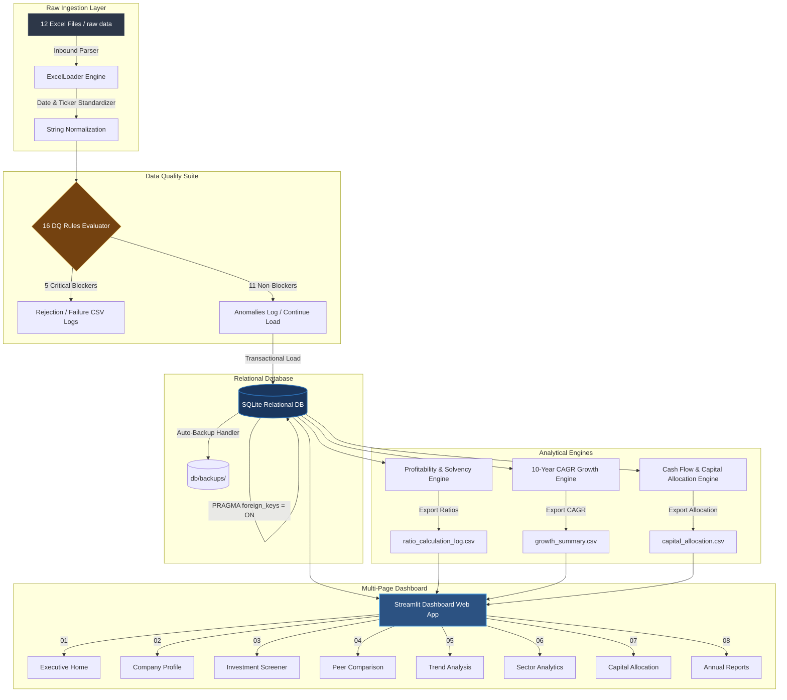

# Nifty 100 Financial Intelligence Platform

<div align="center">


### Production-Grade Financial Data Engineering & KPI Analytics Platform for the Indian Equity Market

**An end-to-end, institutional-grade analytics pipeline that automates raw financial filing ingestion, enforces 16 strict data validation rules, populates a relational database, and generates visual equity research insights.**

---

🚀 [Live Demo (Placeholder)](#) • 📖 [System Design Specification](docs/system_design.md) • 🖥️ [Dashboard Preview](#-dashboard-preview) • 📹 [Demo Video (Placeholder)](#)

---

[](https://www.python.org/)
[](https://sqlite.org/)
[](https://streamlit.io/)
[](https://plotly.com/)
[](https://docs.pytest.org/)
[](LICENSE)

</div>

---

### 📊 Repository Statistics

| 🏢 Companies | 📈 Financial KPIs | 🖥️ Dashboard Screens | 🧪 Test Suite | 🛡️ DQ Rules | ⚡ App Latency |
| :---: | :---: | :---: | :---: | :---: | :---: |
| **92** | **50+** | **8 Independent Pages** | **234 Tests (100% Pass)** | **16 Ingestion Checks** | **< 2.5 Seconds** |

---

### 🛠️ Technology Stack

| Category | Technologies |
| :--- | :--- |
| **Backend & Storage** | Python, SQLite |
| **Data Processing** | Pandas, NumPy, OpenPyXL |
| **Dashboard UI** | Streamlit, Plotly |
| **Testing** | Pytest |
| **VCS & DevOps** | Git, GitHub |

---

## 🎯 About the Project

### 💡 Why this project?
Professional financial terminals like Bloomberg and Reuters charge tens of thousands of dollars, while retail services like Screener.in and Tickertape keep their analytical engines closed-source. This project recreates the entire underlying infrastructure from scratch, showcasing clean data engineering, strict quality control, custom metrics calculations, and premium visualizations.

### ⚠️ The Problem
Raw financial data in the Indian equity markets (specifically Nifty 100 constituents) is highly fragmented. File structures shift between years, tickers are un-normalized, date formats vary, and arithmetic inconsistencies (e.g. mismatched balance sheets or misreported tax rates) corrupt downstream analytics.

### 🛠️ The Solution
A robust, multi-stage ETL pipeline that ingests raw excel filings, runs 16 data quality checks, normalizes data structures into a clean relational database, and exposes calculations through a responsive, multi-page analytical dashboard.

---

## 🚀 Key Highlights

*   **12-Source Ingestion Pipeline**: Auto-detects row/column offsets, stripping white spaces and standardizing ticker names.
*   **16-Rule Data Quality Suite**: Segregates errors into critical blockers (blocking db writes) and warning anomalies.
*   **ACID-Compliant Relational DB**: SQLite engine enforcing referential integrity with cascade deletes and automated load backups.
*   **Flexible Growth & Ratio Engines**: Custom math helpers (`safe_divide`) handling 6 edge cases of CAGR calculation (e.g., turnaround or negative bases) and 8 distinct Capital Allocation Patterns.
*   **Interactive Multi-Page Dashboard**: A Streamlit interface powered by custom-themed Plotly charts.

---

## ⚙️ Project Workflow

```text
Raw Excel Ingest ➔ Data Quality Rules ➔ SQLite DB Ingest ➔ KPI Analytics Engines ➔ Streamlit Dashboard ➔ CSV & PDF Reports
```

---

## 🖥️ Dashboard Preview

The frontend is broken down into **8 comprehensive, independent pages** allowing granular research:

| 🏠 01 Executive Home | 👤 02 Company Profile |
| :---: | :---: |
|  |  |
| 🔍 03 Investment Screener | 📊 04 Peer Comparison |
|  |  |
| 📈 05 Trend Analysis | 🏭 06 Sector Analytics |
|  |  |
| 💰 07 Capital Allocation Map | 📄 08 Reports Browser |
|  |  |

---

## 🏗️ System Architecture



---

## ⚡ Performance Benchmarks

| Benchmark Metric | Measurement |
| :--- | :--- |
| Full ETL Pipeline Ingestion | < 8.0 Seconds |
| Database Seed & Build time | < 5.0 Seconds |
| Dashboard Page Load Latency | < 2.5 Seconds |
| SQL Query Response Time | < 0.1 Seconds |
| Test Suite Execution (234 Tests) | < 12.0 Seconds |

---

## 🛠️ Quick Start

```bash
# 1. Clone & Navigate
git clone https://github.com/krishnavasnani07/n100-financial-intelligence-platform.git
cd n100-financial-intelligence-platform

# 2. Setup environment
python -m venv venv

# 3. Install packages
pip install -r requirements.txt

# 4. Build database & calculate KPIs
python main.py

# 5. Launch interactive web dashboard
streamlit run src/dashboard/app.py
```

<details>
<summary>🔑 Platform-Specific Environment Activation details</summary>

Activate on Windows (Command Prompt):
```cmd
venv\Scripts\activate.bat
```
Activate on Windows (PowerShell):
```powershell
venv\Scripts\Activate.ps1
```
Activate on Linux/macOS:
```bash
source venv/bin/activate
```

</details>

---

## 🧪 Testing & Engineering Quality

A comprehensive test suite containing **234 automated tests** covers database integrity, business logic validation, edge cases, and arithmetic operations:

```bash
python -m pytest tests/ -v
```

---

## 🗺️ Sprint Roadmap

```text
Sprint 1 : Ingestion, Validation & Database Load   [████████████████████] 100% (Completed)
Sprint 2 : Financial KPI Engines & CAGR Analysis   [████████████████████] 100% (Completed)
Sprint 3 : Visualization Engine & CSV Bulk Export   [████████████████████] 100% (Completed)
Sprint 4 : Streamlit Interactive Dashboards        [████████████████████] 100% (Completed)
Sprint 5 : Watchlists, Alerts & REST API Layer     [░░░░░░░░░░░░░░░░░░░░]   0% (Backlog)
```

---

<details>
<summary>📂 Repository Structure Details</summary>

```text
n100-financial-intelligence-platform/
├── README_ASSETS/           # Custom banner, diagrams, and preview screenshots
├── data/                    # Ingestion stages (raw, processed, external)
├── db/                      # Schema DDL, SQLite DB, and automated backups
├── docs/                    # Architectural & domain design guides
├── logs/                    # Operational logging
├── notebooks/               # EDA & SQL prototyping scripts
├── output/                  # Analytics outputs and database audit tables
├── src/                     # Core application source code
│   ├── analytics/           # KPI, CAGR, and Cash Flow engines
│   ├── config/              # Central configurations (ratios, CAGR, cashflow)
│   ├── database/            # SQLite connector & table loaders
│   ├── etl/                 # Excel Ingestion and normalization pipeline
│   ├── utils/               # App logging & helper utilities
│   ├── validation/          # 16 Data Quality rules framework
│   └── dashboard/           # Streamlit app logic & modular components
│       ├── app.py           # Dashboard routing & navigation entrypoint
│       ├── assets/          # CSS stylesheets and brand logos
│       ├── components/      # Reusable UI charts, tables, & filters
│       ├── pages/           # 8 analytical dashboard screens
│       └── utils/           # Shared database query connections
├── tests/                   # 234 automated pytest suites
├── main.py                  # CLI pipeline runner
├── requirements.txt         # Package dependencies
└── README.md                # Project documentation
```

</details>

<details>
<summary>📐 Technical Details & KPI Formulations</summary>

### 1. Profitability & Solvency Ratios
- **Net Profit Margin (NPM)**:
  $$\text{NPM} = \frac{\text{Net Profit}}{\text{Sales Revenue}} \times 100$$
  *Benchmarking*: Excellent ($\ge 15\%$), Good ($\ge 10\%$), Average ($\ge 5\%$), Weak ($< 5\%$).
- **Return on Equity (ROE)**:
  $$\text{ROE} = \frac{\text{Net Profit}}{\text{Equity Capital} + \text{Reserves}} \times 100$$
  *Edge Case*: Assigns `None` with `NON_POSITIVE_EQUITY` status if equity $\le 0$ to avoid false division anomalies.
- **Return on Capital Employed (ROCE)**:
  $$\text{ROCE} = \frac{\text{EBIT}}{\text{Equity Capital} + \text{Reserves} + \text{Borrowings}} \times 100$$
- **Debt-to-Equity (D/E)**:
  $$\text{D/E} = \frac{\text{Borrowings}}{\text{Equity Capital} + \text{Reserves}}$$
- **Interest Coverage Ratio (ICR)**:
  $$\text{ICR} = \frac{\text{Operating Profit} + \text{Other Income}}{\text{Interest Expense}}$$

### 2. Growth & Cash Flow Analytics
- **Compound Annual Growth Rate (CAGR)**:
  $$\text{CAGR} = \left[\left(\frac{\text{End Value}}{\text{Start Value}}\right)^{\frac{1}{\text{Years}}} - 1\right] \times 100$$
- **Free Cash Flow (FCF)**:
  $$\text{FCF} = \text{CFO} + \text{CFI}$$
- **CFO Quality Score**:
  $$\text{CFO Quality} = \frac{\text{CFO}}{\text{PAT}}$$
- **Capital Allocation Patterns**: Evaluates net direction $(\text{CFO}, \text{CFI}, \text{CFF})$ signs to identify corporate strategies (Reinvestor, Liquidator, Cash Accumulator, Distress Signal, etc.).

</details>

<details>
<summary>🛡️ Ingest Validation (16 DQ Rules)</summary>

#### Blocker Rules (Ingestion Stops on Failure)
- **DQ-01**: Primary Key Uniqueness on companies.
- **DQ-02**: Composite Uniqueness on `(company_id, year)`.
- **DQ-03**: Foreign Key referential integrity.
- **DQ-07**: Date formatting (`YYYY-MM` check).
- **DQ-08**: Ticker format validation.

#### Warning Rules (Load Continues, Log Warns)
- **DQ-04**: Balance Sheet balances (`Total Assets == Total Liabilities`).
- **DQ-05**: Calculated vs. Reported Operating Margins check.
- **DQ-06**: Positive sales validation.
- **DQ-09**: Net cash flow sum checksum.
- **DQ-10**: Fixed Assets boundary check.
- **DQ-11**: Tax rate limits ($[0\%, 100\%]$).
- **DQ-12**: Dividend payout bounds.
- **DQ-13**: Web page URL validations.
- **DQ-14**: Net profit and EPS sign alignment.
- **DQ-15**: Balance Sheet sub-category validations.
- **DQ-16**: Historical record length threshold ($>5$ years).

</details>

---

## 🎓 Skills Demonstrated & Resume Alignment

- **Data Engineering**: Multi-stage ETL, schema validation, ACID compliance, relational database design, transaction handling, and auto-backups.
- **Financial Analytics**: Implementation of complex equity research calculations (profitability, leverage, multi-period CAGR engines, and cash flow strategies).
- **Frontend & Visualization**: Multi-page web dashboard routing, Plotly interactive graphics (polar plots, treemaps, bubble charts).
- **Software Engineering**: Pytest suite automation, clean code structuring, configuration separations, and error boundary handling.

---

## 🤝 Acknowledgements

- **Bluestock Fintech** for project requirements and datasets.
- **Screener.in** and **Tickertape** for functional inspiration.
- Open source libraries: **Streamlit**, **Plotly**, and **Pandas**.

---

## 👤 About the Developer

**Krishna Vasnani** - Bluestock Fintech Analytics Intern

- **GitHub**: [@krishnavasnani07](https://github.com/krishnavasnani07)
- **LinkedIn**: [Krishna Vasnani](https://linkedin.com/in/krishnavasnani07)
- **Email**: krishnavasnani07@gmail.com
- **Project**: Nifty 100 Financial Intelligence Platform

---

<div align="center">

MIT License • Made with ❤️ using Python and Streamlit

</div>
