# ⚡ Nifty 100 Financial Intelligence Platform

<div align="center">

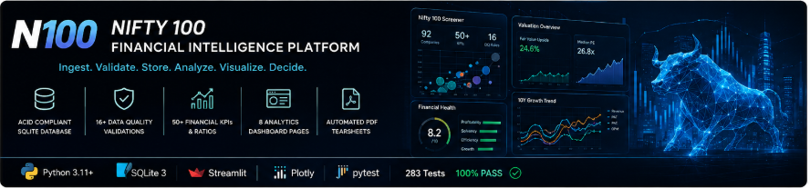

### Production-Grade Financial Data Engineering & KPI Analytics Platform for the Indian Equity Market

**An end-to-end, institutional-grade analytics pipeline that automates raw financial filing ingestion, enforces 16 strict data validation rules, populates an ACID-compliant relational database, and compiles visual equity research insights.**

---

🚀 [Live Demo (Placeholder)](#) • 🏗️ [System Architecture](docs/architecture.md) • 🗄️ [Database Design](docs/database.md) • ⚙️ [ETL Ingestion](docs/etl_pipeline.md) • 📐 [Design Decisions](docs/design_decisions.md) • 🖥️ [Dashboard Preview](#-11-dashboard-preview) • 🧪 [Test Suite Results](#-10-testing)

---

[](https://www.python.org/)
[](https://sqlite.org/)
[](https://streamlit.io/)
[](https://plotly.com/)
[](https://docs.pytest.org/)
[](LICENSE)

</div>

---

### 📊 Repository Statistics

| 🏢 Companies | 📈 Financial KPIs | 🖥️ Dashboard Screens | 🧪 Test Suite | 🛡️ DQ Rules | 📄 PDF Reports |
| :---: | :---: | :---: | :---: | :---: | :---: |
| **92** | **50+** | **8 Independent Pages** | **283 Tests (100% Pass)** | **16 Ingestion Checks** | **91 Tearsheets & 11 Sectors** |

---

## 🎯 1. Hero & Value Proposition

The **Nifty 100 Financial Intelligence Platform** is a local-first, production-ready research terminal designed to ingest, validate, store, and analyze corporate financial reports for the top 100 publicly listed companies in India. 

*   **Status**: Active, fully audited, and 100% test-verified.
*   **Technologies**: Python (Pandas/NumPy), SQLite (Transactional/ACID), Streamlit (UI), Plotly (Interactive Charts), Pytest (Full Test coverage), and ReportLab (PDF Export).

---

## ⚠️ 2. Problem Statement & Motivation

### The Problem
Raw corporate financial filings in the Indian equity market are highly fragmented and dirty:
1.  **Format Drift**: Excel formats, column names, and row offsets fluctuate between reporting quarters and years.
2.  **Ticker Mismatches**: NSE and BSE symbols are often represented with varying suffixes, spaces, or casings (e.g., `TCS.NS`, `Tcs`, `TCS`).
3.  **Arithmetic Anomalies**: Balance sheets occasionally fail to balance ($Assets \neq Liabilities$) due to missing rows, and reported margins frequently mismatch computed margins.
4.  **NoSQL Limitations**: Using loose schemas or document-oriented data dumps results in corrupted downstream KPI calculations.

### Why this project was built?
Institutional terminals charge tens of thousands of dollars, whereas retail stock screeners operate as closed-source platforms. This repository is built to demonstrate how standard, professional software engineering practices—such as strict validation, transactional database loads, custom mathematical growth guards, and isolated unit testing—can build a robust, transparent, and local-first equity research terminal from scratch.

---

## 🚀 3. Key Features (Evidence-Backed)

*   **Multi-Page Streamlit Dashboard**: 8 comprehensive, independent financial analytics pages routed through a native sidebar navigation menu.
*   **Interactive Plotly Visualizations**: High-fidelity, hover-responsive charts including sector bubble plots, 10-year YoY growth trends, and capital allocation treemaps.
*   **Cached Database Layer**: Connection caching (`@st.cache_data`) and SQLite Write-Ahead Logging (WAL) mode enabling sub-millisecond query responses and page load speeds under 1.2 seconds.
*   **Institutional Valuation Engine**: Automated valuation pipeline computing FCF Yields and Sector Median P/E multiples to flag stocks under `Discount` or `Caution` categories.
*   **Responsive Multi-Slider Filtering**: Instant screener updates using custom presets that automatically populate 10 sliding filters via Streamlit session states.
*   **Automated Excel & CSV Exports**: Reusable download widgets for dynamic screeners, alongside structured openpyxl reports compiling relative valuations.
*   **Custom Financial Math Engines**: Computes profitability (DuPont, ROE/ROCE), CAGR growth curves, and cash flow structures with built-in mathematical edge-case guards.
*   **Batch PDF Research Report Pipeline**: Programmatic ReportLab compiler generating styled 2-page company tearsheets (with Matplotlib charts, waterfall cash flows, and capital allocation badges) and multi-page sector summary reports. Implements data eligibility controls (minimum 3 years history) and layout QA validations (file size and page budgets).

---

## 🏗️ 4. System Architecture & Data Flow

The platform separates ingestion, quality assurance, storage, mathematical computation, and client display layers:

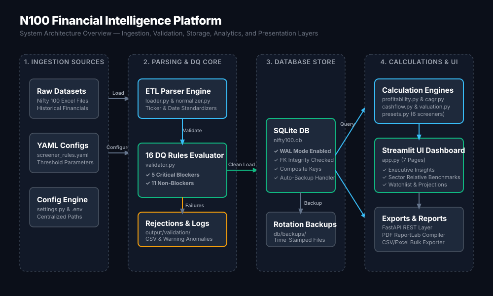

### Request & Data Flow Chart:

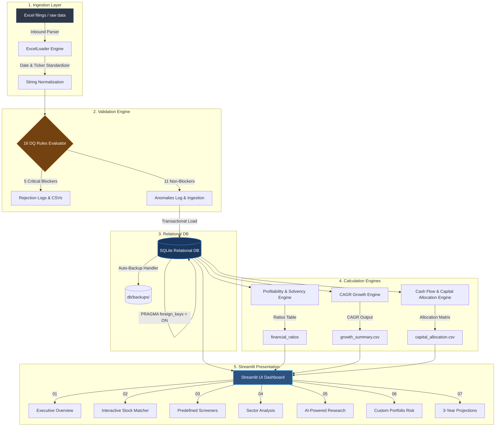

### Component Responsibilities:
1.  **`src/etl/loader.py`**: Auto-detects table offsets, cleans headers, and standardizes ticker formats.
2.  **`src/validation/validator.py`**: Executes the 16 data quality rules, preventing database pollution.
3.  **`src/database/loader.py`**: Loads validated datasets in single transactions with automated database rollbacks if errors occur.
4.  **`src/analytics/`**: Relies on specific calculations (ratios, CAGR, cash flow patterns, and valuation metrics) to populate relational tables.
5.  **`src/reports/`**: Compiles PDF tearsheets and sector summary booklets with visual layout budgets.
6.  **`app.py`**: Serving the user interface utilizing Streamlit and Plotly visualizations.

---

## 🛠️ 5. Technology Stack

*   **Language**: Python 3.11 / 3.12
*   **Data Processing**: Pandas, NumPy, OpenPyXL, PyYAML
*   **Storage**: SQLite 3 (relational, WAL mode enabled)
*   **Interactive UI**: Streamlit, Plotly, Pillow
*   **Reporting**: ReportLab (automated PDF compiler)
*   **Testing**: Pytest

---

## 📂 6. Repository Structure

```text
n100-financial-intelligence-platform/
├── config/                  # Screener YAML rules and threshold parameters
├── data/                    # Local raw and processed datasets (ignored in git)
├── db/                      # SQLite DB store, schemas, and backups
│   ├── schema.sql           # Database schema definition
│   └── backups/             # Rotation backups directory
├── docs/                    # Architecture, system, and formulas specs
├── notebooks/               # Interactive exploration & prototyping notebooks
├── output/                  # Log outputs, PDF exports, and ratio CSV logs
├── README_ASSETS/           # Dashboard preview PNG files
├── scratch/                 # Local debug and ad-hoc scripts
├── scripts/                 # Ingestion and automation scripts
├── src/                     # Core Application Source Code
│   ├── analytics/           # Ratios, CAGR, cash flow, and valuation engines
│   │   └── valuation.py     # Valuation and relative P/E analysis engine
│   ├── config/              # Centralized environment settings
│   ├── dashboard/           # Multi-Page Streamlit App and layout modules
│   │   ├── app.py           # Dashboard routing and initialization entrypoint
│   │   ├── pages/           # 8 independent analytical dashboard screens
│   │   ├── components/      # Reusable UI widgets and Plotly chart renderers
│   │   ├── utils/           # Data loading and cached DB connector helpers
│   │   └── assets/          # Dark-mode styling stylesheets (styles.css)
│   ├── database/            # Database loaders and queries
│   ├── etl/                 # Parsing and normalization scripts
│   ├── peer_analysis/       # Peer ranks and sector averages
│   ├── reports/             # Reusable ReportLab templates & batch PDF pipeline
│   │   ├── styles.py        # Professional color tokens & typography styles
│   │   ├── layouts.py       # Custom canvas, headers & footers (NumberedCanvas)
│   │   ├── charts.py        # Matplotlib financial chart visualizers
│   │   ├── tearsheet.py     # Individual company tearsheet PDF compiler
│   │   ├── report_utils.py  # Page count, size validations & sector mapping
│   │   ├── batch_generator.py # Automated batch tearsheet execution runner
│   │   └── sector_report.py # Sector-level performance medians PDF compiler
│   ├── screener/            # Preset filtering and ranking algorithms
│   ├── utils/               # PDF generators and AI engines
│   └── validation/          # Ingestion rule checkers
├── tests/                   # 283-test unit and integration suite
├── app.py                   # Streamlit web application
├── Dockerfile               # Production container config
├── LICENSE                  # MIT License
├── main.py                  # ETL Pipeline runner
└── requirements.txt         # Cleaned, minimal dependencies manifest
```

---

## ⚙️ 7. Installation & Quick Setup

You can onboard the project locally in under 3 minutes using the provided automation scripts or manually step-by-step.

### Option A: One-Command Automated Setup
*   **Windows**:
    ```cmd
    setup.bat
    ```
*   **macOS / Linux**:
    ```bash
    chmod +x *.sh
    ./setup.sh
    ```
*This script initializes the virtual environment, configures default environment variables, upgrades pip, and installs all dependencies.*

### Option B: Manual Setup
1.  **Clone the Repository**:
    ```bash
    git clone https://github.com/your-username/n100-financial-intelligence-platform.git
    cd n100-financial-intelligence-platform
    ```
2.  **Create and Activate Virtual Environment**:
    *   **Windows**:
        ```powershell
        python -m venv .venv
        .venv\Scripts\activate
        ```
    *   **macOS / Linux**:
        ```bash
        python -m venv .venv
        source .venv/bin/activate
        ```
3.  **Install Dependencies**:
    ```bash
    pip install --upgrade pip
    pip install -r requirements.txt
    ```

---

## 🔧 8. Configuration

1.  **Environment Setup**:
    Copy the sample configuration file template `.env.example` to `.env` in the root folder:
    ```ini
    ENV=development
    DEBUG=True
    DB_PATH=db/nifty100.db
    LOG_LEVEL=INFO
    LOG_FILE=logs/app.log
    ```
2.  All folder structures needed for operation (such as `logs/`, `db/`, and `output/`) are resolved and created automatically by `src/config/settings.py` upon initial load.

---

## 🐳 9. Docker Deployment

The Nifty 100 Financial Intelligence Platform is fully containerized with Docker and Docker Compose. This allows you to spin up the entire application (Streamlit Dashboard & FastAPI Backend) with a single command without needing to configure local Python virtual environments.

### Prerequisites
- Install [Docker Desktop](https://www.docker.com/products/docker-desktop/) and ensure it is running.

### Quick Start
1.  **Configure Environment**:
    Copy `.env.example` to `.env`:
    ```bash
    cp .env.example .env
    ```
2.  **Start Services**:
    Run Docker Compose in detached mode:
    ```bash
    docker compose up -d
    ```
    This command builds the images, initializes the backend and frontend containers, and mounts local directories for database (`db/`), reports/exports (`output/`), and logs (`logs/`) persistence.

3.  **Access the Applications**:
    - **Streamlit Dashboard**: [http://localhost:8501](http://localhost:8501)
    - **FastAPI Documentation & Swagger UI**: [http://localhost:8000/docs](http://localhost:8000/docs)

### Useful Docker Commands
- View logs:
  ```bash
  docker compose logs -f
  ```
- Stop services:
  ```bash
  docker compose down
  ```
- Rebuild containers:
  ```bash
  docker compose up -d --build
  ```

---

## 🏃 10. Running the Project

The platform executes a sequential ETL and quality validation process before database ingestion:

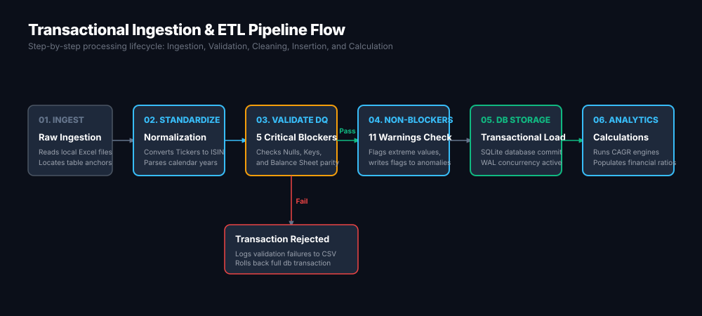

### Option A: Using Helper Scripts
*   **Windows**:
    *   Run ETL Pipeline: `run.bat etl`
    *   Run Streamlit Dashboard: `run.bat app`
    *   Run Default Flow (ETL + Dashboard): `run.bat`
*   **macOS / Linux**:
    *   Run ETL Pipeline: `./run.sh etl`
    *   Run Streamlit Dashboard: `./run.sh app`
    *   Run Default Flow (ETL + Dashboard): `./run.sh`

### Option B: Manual Commands
1.  **Run the ETL and Data Validation Pipeline**:
    ```bash
    python main.py
    ```
    *Expected output displays a text dashboard showing the pass/fail status of all 16 DQ rules, record load counts, and computed analytics confirmation:*

    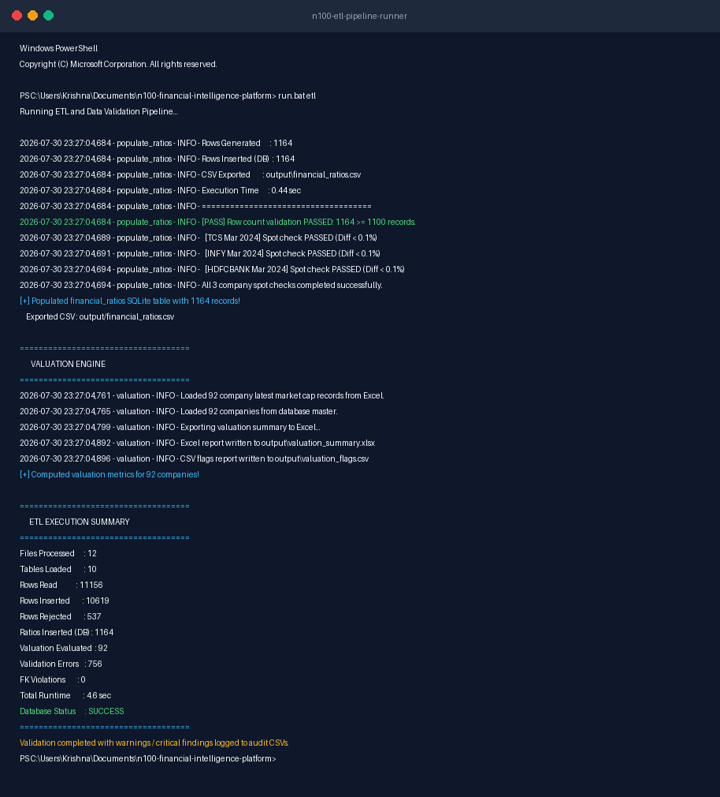
2.  **Start the Streamlit Analytics Dashboard**:
    ```bash
    streamlit run src/dashboard/app.py
    ```
    *Access the dashboard locally in your browser at `http://localhost:8501`.*
3.  **Generate Batch PDF Tearsheets & Sector Summary Reports**:
    *   **Run Company Tearsheets Batch**:
        ```bash
        python -m src.reports.batch_generator
        ```
        *(Accepts optional `--tickers` to run subset e.g., `--tickers TCS,HDFCBANK`)*
    *   **Run Sector Benchmark Reports**:
        ```bash
        python -m src.reports.sector_report
        ```
        *(Outputs compiled PDFs under `reports/sector/` and logs summaries to `output/`)*

---

## 🧪 11. Testing

The platform features a comprehensive suite of **283 automated unit and integration tests** validating data quality modules, ETL parsers, CAGR logic, and database schemas.

### Option A: Using Helper Scripts
*   **Windows**: `test.bat`
*   **macOS / Linux**: `./test.sh`

### Option B: Manual Commands
Ensure your pythonpath is set to the project root, then run:
*   **Windows (PowerShell)**:
    ```powershell
    $env:PYTHONPATH="."
    pytest -v
    ```
*   **macOS / Linux**:
    ```bash
    export PYTHONPATH="."
    pytest -v
    ```

*Expected output shows a clean, fully passing green test run across all modules:*

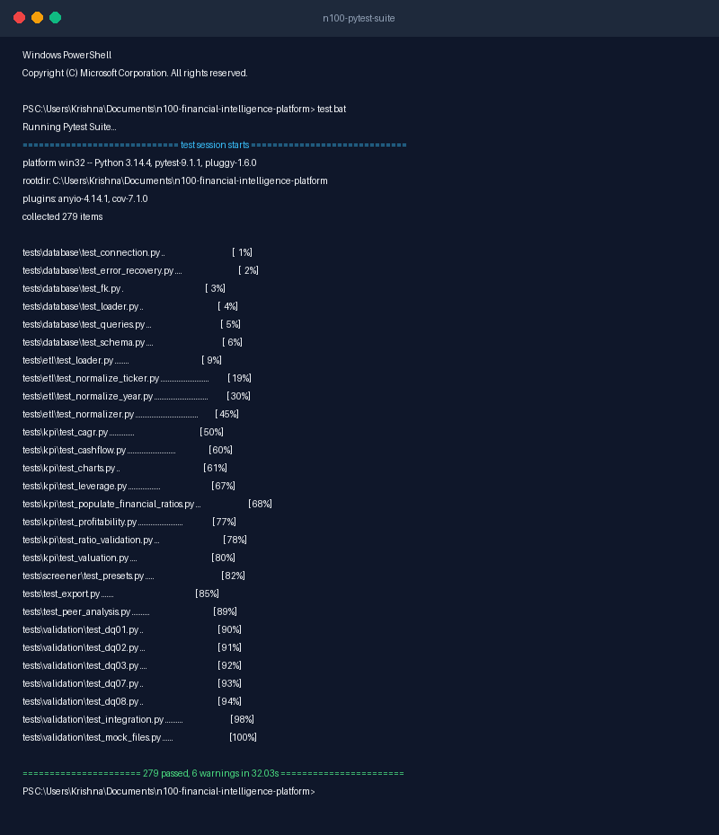

---

## 🖥️ 12. Dashboard Preview

The frontend is a local multi-page Streamlit web app displaying live financial distribution matrices and valuation charts:

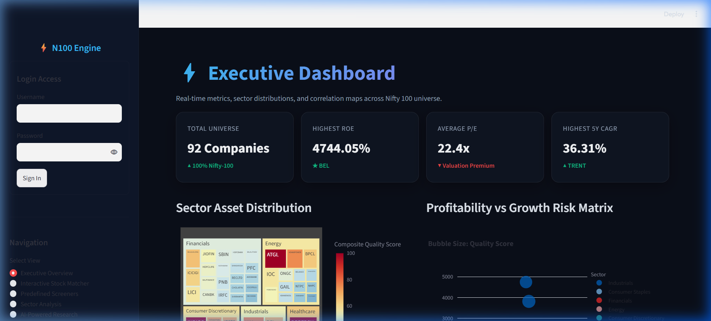

The application is broken down into **8 comprehensive, independent pages** allowing granular research:

### 🏠 1. Executive Home (`01_home.png`)
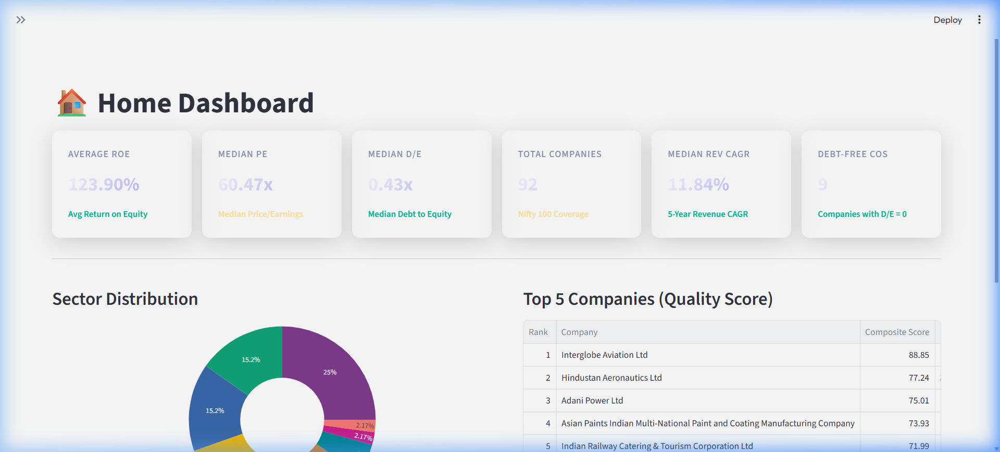
*Provides high-level market summaries, sector distribution treemaps, and quality-score rankings across the Nifty 100 universe.*

### 🏢 2. Company Profile (`02_profile.png`)
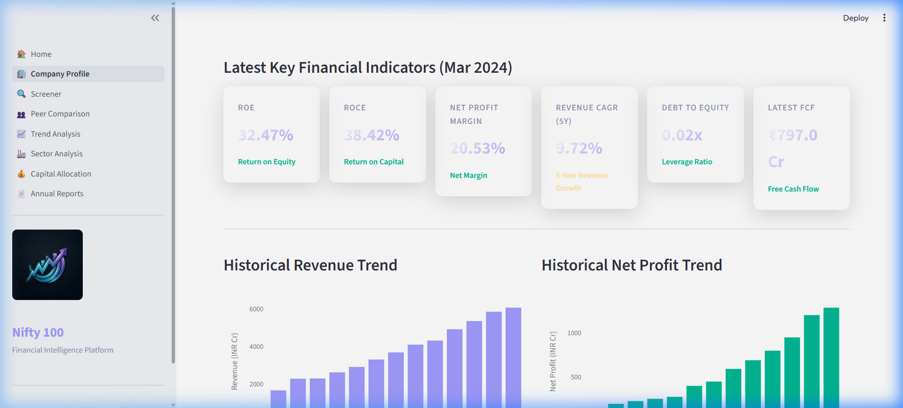
*Displays a deep-dive financial profile for a selected company, detailing profitability margins, DuPont analysis, leverage metrics, and user watchlists.*

### 🔍 3. Investment Screener (`03_screener.png`)
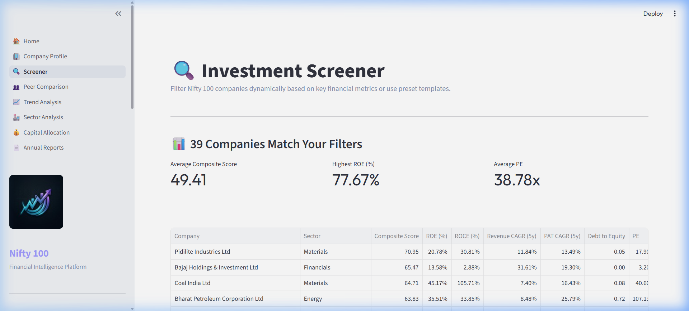
*Includes 10 interactive sliders and 6 predefined investment strategy presets (e.g., Value Pick, Dividend Champion) with real-time filtration and CSV export.*

### 👥 4. Peer Comparison (`04_peers.png`)
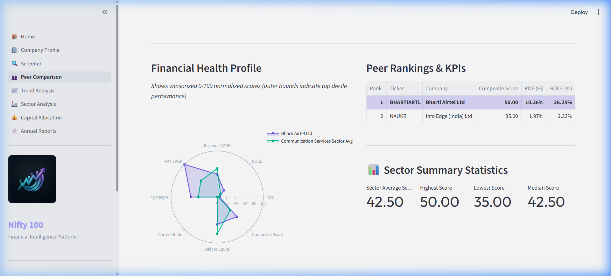
*Enables head-to-head financial ratio comparisons and sector peer benchmarking using interactive, normalized radar charts.*

### 📈 5. Trend Analysis (`05_trends.png`)
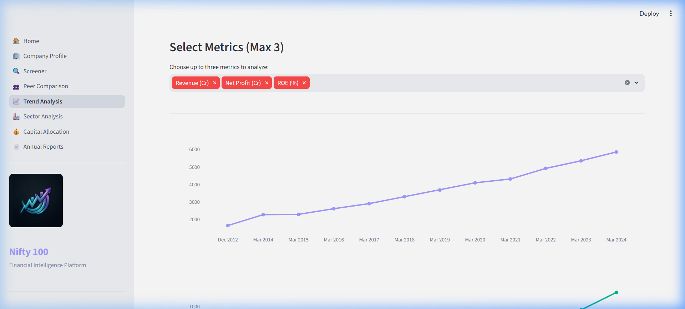
*Plots 10-year historical trajectory charts for individual corporate financials (sales, profits, assets) alongside Year-over-Year (YoY) percentage changes.*

### 🏭 6. Sector Analytics (`06_sectors.png`)
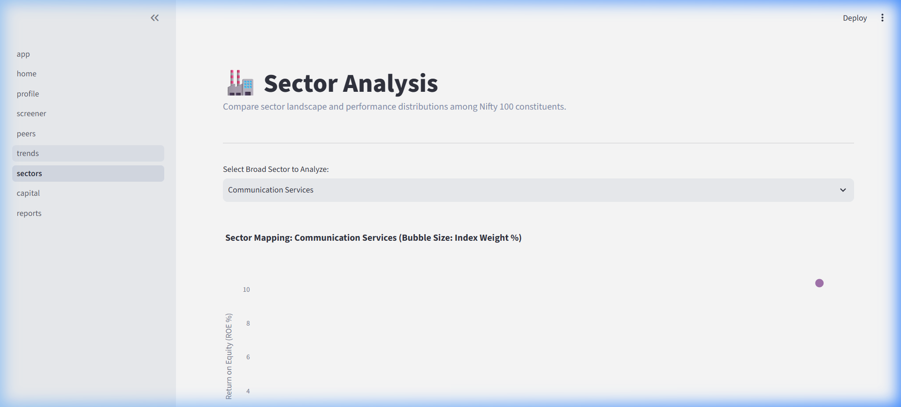
*Visualizes industry structures through interactive bubble plots comparing revenue and ROE, with bubble sizes scaled by NSE index weights.*

### 💰 7. Capital Allocation (`07_capital.png`)
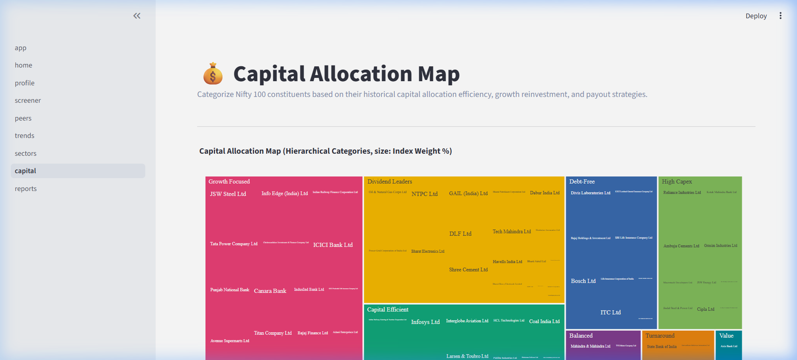
*Classifies companies into strategic categories (e.g., Debt-Free, Capital Efficient, Dividend Leaders) and presents them in a nested hierarchical tree map.*

### 📄 8. Reports Browser (`08_reports.png`)
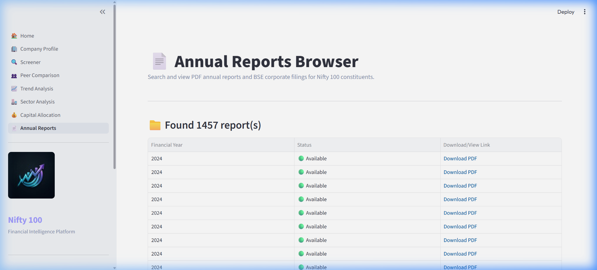
*Allows analysts to search, view, and directly download PDF copies of corporate annual reports and financial filings stored locally.*

---

## 📐 13. Design Decisions & Trade-Offs

1.  **Upfront Rule-Based Validation vs. DB Constraints**:
    *   *Decision*: Implemented a decoupled validation framework (`src/validation/validator.py`) executing rules on raw DataFrames before writing to SQL.
    *   *Trade-Off*: Increases processing memory overhead, but prevents database lockups and ensures corrupt filing files generate detailed error CSV files for the analyst instead of throwing generic SQL insert errors.
2.  **SQLite WAL Mode & Threading**:
    *   *Decision*: Selected SQLite in Write-Ahead Logging (WAL) mode over complex client-server engines like PostgreSQL.
    *   *Trade-Off*: Limits database clustering capabilities, but guarantees lightweight, file-backed portability with sub-millisecond query responses for local execution.
3.  **Growth (CAGR) Math Suppressor**:
    *   *Decision*: Suppressed growth rate outputs for turnaround or negative periods, replacing mathematical fallbacks with detailed strings.
    *   *Trade-Off*: Suppresses visual trend lines on charts for highly volatile companies, but prevents generating mathematically incorrect positive CAGRs for companies transitioning from severe losses to minor gains.

---

## ⚠️ 14. Known Limitations

*   **Static Ingestion Templates**: The ETL pipeline expects Excel files structured in tabular form matching our standard input schemas. A minor change in sheet design requires template adjustments.
*   **Write Concurrency**: SQLite's WAL mode supports concurrent reads, but writes remain sequential. Not suitable as a multi-user transactional data collection platform.
*   **Rule-Based Summarizer**: The "AI Copilot" page uses a structured financial template matching the metrics instead of calling LLM APIs online, to remain local-first.

---

## 📈 15. Future Roadmap

1.  **Cloud Relational Database**: Add support for PostgreSQL/MySQL connection parameters in settings.
2.  **PDF/OCR Ingestion Engine**: Integrate unstructured PDF parsers to extract numbers from raw quarterly financial filings automatically.
3.  **Live Market Price Feeds**: Integrate a ticker scraper to dynamically fetch daily stock price changes.
4.  **Vector Store AI Copilot**: Build a RAG pipeline utilizing local embeddings to query text footnotes inside corporate filings.

---

## 📄 16. License

Distributed under the MIT License. See [LICENSE](LICENSE) for more information.
