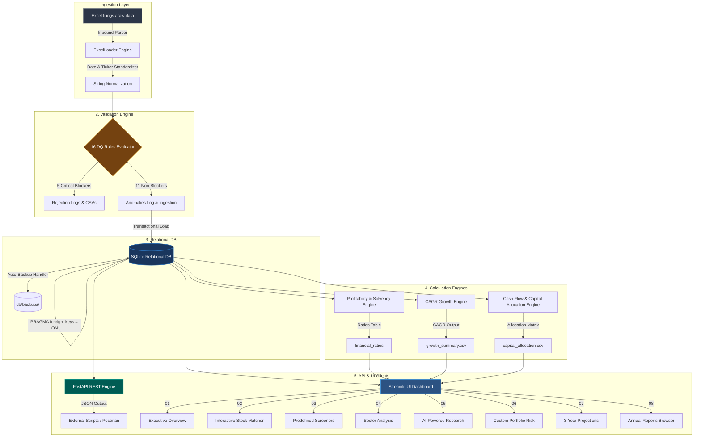

# ⚡ Nifty 100 Financial Intelligence Platform

<div align="center">


### Production-Oriented Financial Data Engineering & KPI Analytics Platform for the Indian Equity Market

**An end-to-end, local-first analytics pipeline that automates raw financial filing ingestion, enforces 16 strict data validation rules, populates an indexed relational database, and compiles visual equity research insights.**

---

🚀 [System Architecture](docs/architecture.md) • 🗄️ [Database Design](docs/database.md) • 🔌 [FastAPI Details](docs/API.md) • 📐 [Design Decisions](docs/design_decisions.md) • 🖥️ [Dashboard Preview](#-11-dashboard-preview) • 🧪 [Test Suite Results](#-10-testing)

---

[](https://www.python.org/)
[](https://sqlite.org/)
[](https://fastapi.tiangolo.com/)
[](https://streamlit.io/)
[](https://plotly.com/)
[](https://docs.pytest.org/)
[](LICENSE)
[](https://github.com/krishnavasnani07/n100-financial-intelligence-platform/actions/workflows/ci.yml)

</div>

---

### 📊 Repository Statistics

| 🏢 Companies | 📈 Financial KPIs | 🖥️ Dashboard Screens | 🔌 API Endpoints | 🛡️ DQ Ingestion Rules | 🧪 Automated Tests | 📄 PDF Reports |
| :---: | :---: | :---: | :---: | :---: | :---: | :---: |
| **92** | **50+** | **8 Pages** | **24 REST Routes** | **16 Validation Rules** | **211 Tests (100% Pass)** | **92 Tearsheets + 11 Sectors** |

---

## 🎯 What Is This?

This project builds an end-to-end financial intelligence pipeline for the Nifty 100 universe. It ingests structured financial data from raw filing formats, normalizes and validates it through 16 data-quality rules, stores it in a locally indexed SQLite database, computes 50+ financial KPIs, exposes analytics through a FastAPI REST backend, and presents the results through an interactive Streamlit research dashboard.

### Project at a Glance

| Layer | Technology Stack | Primary Responsibility |
|---|---|---|
| **Ingestion** | Python / Pandas / OpenPyXL | Auto-detect sheet offsets, standardize ticker casings, and load raw filing data. |
| **Validation** | Custom Data Quality Engine | Evaluate 16 data-quality validation rules prior to ingestion. |
| **Storage** | SQLite 3 (WAL Mode) | Relational persistence with foreign keys and multi-index lookups. |
| **Analytics** | Pandas / NumPy / Scikit-Learn | Compute 50+ financial KPIs, CAGR growth metrics, and execute KMeans clustering. |
| **API** | FastAPI / Uvicorn | Expose versioned REST endpoints with autogenerated interactive Swagger documentation. |
| **Dashboard** | Streamlit / Plotly | Render interactive charts, search overlays, multi-slider screeners, and watchlists. |
| **Reports** | ReportLab / Matplotlib | Compile batch PDF tearsheets and multi-page sector benchmark reports. |
| **Testing** | Pytest / Pytest-HTML | Layer-based unit, API, and integration test coverage verifying code correctness. |

---

## 💡 Problem & Motivation

### The Problem
Raw corporate financial filings in the Indian equity market are highly fragmented and dirty:
1. **Format Drift**: Excel structures, column names, and row offsets fluctuate between reporting quarters and years.
2. **Ticker Mismatches**: NSE and BSE symbols are represented with varying suffixes, spaces, or casings (e.g., `TCS.NS`, `Tcs`, `TCS`).
3. **Arithmetic Anomalies**: Balance sheets occasionally fail to balance ($Assets \neq Liabilities$) due to missing rows, and reported margins frequently mismatch computed margins.
4. **NoSQL Limitations**: Ingesting raw dumps without strict schema verification leads to downstream calculation failures.

### The Solution
Instead of charging tens of thousands of dollars for institutional terminals or relying on closed-source retail screeners, this platform demonstrates how standard software engineering practices—such as transactional schema loading, mathematical growth rate guards, decoupled validation, and automated unit testing—can build a robust, transparent, and local-first research engine.

---

## ✨ Key Features

* **Multi-Page Streamlit Dashboard**: 8 comprehensive, independent financial analytics pages routed through a native sidebar navigation menu.
* **Interactive Plotly Visualizations**: High-fidelity, hover-responsive charts including sector bubble plots, 10-year YoY growth trends, and capital allocation treemaps.
* **Cached Database Layer**: Connection caching (`@st.cache_data`) and SQLite Write-Ahead Logging (WAL) mode enabling sub-millisecond query responses and page load speeds.
* **Institutional Valuation Engine**: Automated valuation pipeline computing FCF Yields and Sector Median P/E multiples to flag stocks under `Discount` or `Caution` categories.
* **Responsive Multi-Slider Filtering**: Instant screener updates using custom presets that automatically populate 10 sliding filters via Streamlit session states.
* **Automated Excel & CSV Exports**: Reusable download widgets for dynamic screeners, alongside structured openpyxl reports compiling relative valuations.
* **Custom Financial Math Engines**: Computes profitability (DuPont, ROE/ROCE), CAGR growth curves, and cash flow structures with built-in mathematical edge-case guards.
* **Batch PDF Research Report Pipeline**: Programmatic ReportLab compiler generating styled 2-page company tearsheets and multi-page sector summary reports. Implements data eligibility controls and layout QA validations.
* **FastAPI REST API Layer**: Clean versioned endpoints providing programmatic database access for external scripts, tools, and clients.

---

## 🧠 Engineering Highlights

* **Transactional SQLite Ingestion**: Ingests raw data using single-session SQLite database transactions, ensuring automatic rollbacks on ingestion failure to prevent schema corruption.
* **Write-Ahead Logging (WAL)**: Configures SQLite in WAL mode to support parallel read actions and reduce database access latencies.
* **Deterministic KPI Calculations**: Uses strict mathematical formulas with built-in growth division-by-zero guards to prevent NaN outputs.
* **Reproducible Clustering**: Performs KMeans peer clustering using a fixed random state for predictable grouping.
* **Data-Quality Validation**: Decouples 16 schema and integrity rules from direct SQL load, creating detailed error CSV logs on validation failure.

---

## 🏗️ Architecture & Data Flow

The platform separates ingestion, quality assurance, storage, mathematical computation, and client display layers:

```text
                    ┌──────────────────┐
                    │  Financial Data  │
                    └────────┬─────────┘
                             ↓
                    ┌──────────────────┐
                    │   ETL + DQ       │
                    │ 16 Validation    │
                    │ Rules            │
                    └────────┬─────────┘
                             ↓
                    ┌──────────────────┐
                    │     SQLite       │
                    │ Relational DB    │
                    └───────┬──────────┘
                            ↓
                 ┌──────────┴──────────┐
                 ↓                     ↓
          ┌──────────────┐      ┌──────────────┐
          │   Analytics  │      │   FastAPI    │
          │ 50+ KPIs     │      │ REST API     │
          └──────┬───────┘      └──────┬───────┘
                 ↓                     ↓
          ┌──────────────┐      ┌──────────────┐
          │  Streamlit   │      │ API Clients  │
          │  Dashboard   │      │ / Postman    │
          └──────────────┘      └──────────────┘
```

---

## 🔄 End-to-End Data Flow



### Component Responsibilities:
1. **`src/etl/loader.py`**: Auto-detects table offsets, cleans headers, and standardizes ticker formats.
2. **`src/validation/validator.py`**: Executes the 16 data quality rules, preventing database pollution.
3. **`src/database/loader.py`**: Loads validated datasets in single transactions with automated database rollbacks if errors occur.
4. **`src/analytics/`**: Relies on specific calculations (ratios, CAGR, cash flow patterns, and valuation metrics) to populate relational tables.
5. **`src/api/`**: Serves versioned JSON responses to clients, enabling external script integrations.
6. **`src/reports/`**: Compiles PDF tearsheets and sector summary booklets with visual layout budgets.
7. **`app.py`**: Serving the user interface utilizing Streamlit and Plotly visualizations.

---

## 📊 Analytics & KPI Engine

The analytics engine processes raw corporate filings to generate normalized financial metrics:
* **DuPont Engine**: Breaks down Return on Equity (ROE) into Net Profit Margin, Asset Turnover, and Equity Multiplier to identify the operational driver behind company returns.
* **Growth Suppressor**: Turnaround periods (transitioning from deep losses to minor profits) are flagged, and CAGR calculations are suppressed when mathematically invalid, preventing erroneous positive growth spikes.

---

## 📐 KPI Methodology

We calculate and verify key performance indicators (KPIs) following standard financial math guidelines:
* **ROE (Return on Equity)**: $\text{Net Income} / \text{Average Shareholders Equity}$
* **ROCE (Return on Capital Employed)**: $\text{EBIT} / (\text{Total Assets} - \text{Current Liabilities})$
* **Operating Profit Margin (OPM)**: $\text{Operating Profit} / \text{Revenue}$
* **Debt-to-Equity (D/E)**: $\text{Total Debt} / \text{Total Shareholders Equity}$ (suppressed for the *Financials* sector)
* **Interest Coverage Ratio**: $\text{EBIT} / \text{Interest Expense}$
* **Revenue / PAT / FCF CAGR**: Compound Annual Growth Rate measured over 3, 5, and 10-year windows.
* **Valuation Categories**: Stocks classified into *Discount*, *Fair*, or *Caution* based on relative P/E vs. Sector Medians and historical FCF Yields.

For detailed formulas, math definitions, and edge-case guards, refer to:
* [financial_formulas.md](docs/financial_formulas.md)

---

## 🛡️ Data Quality Validation

Prior to database insertion, all datasets must pass 16 checks grouped into five layers:

| Category | Checks | Description / Action |
|---|:---:|---|
| **Schema Integrity** | 5 | Verifies column mappings, data types, standard headers, and table structures. *Critical Blocker.* |
| **Financial Consistency** | 4 | Confirms Balance Sheet balances ($Assets = Liabilities$) and checks for logical relationships. *Critical Blocker.* |
| **Missing Data** | 3 | Traces null values, gap detection for missing years, and flags incomplete data. *Non-blocker.* |
| **Referential Integrity** | 2 | Maps tickers to master metadata lists and checks sector allocations. *Critical Blocker.* |
| **Business Rules** | 2 | Validates that reporting periods are logical and prevents division by zero in ratios. *Non-blocker.* |
| **Total Rules** | **16** | *5 rules act as Critical Blockers (rejects filing), while 11 generate anomaly logs.* |

For the rule specifications, refer to [etl_pipeline.md](docs/etl_pipeline.md).

---

## 🔌 API

FastAPI exposes the platform's analytical data through a versioned REST API.

* **Base URL**: `http://localhost:8000/api/v1`
* **Interactive Documentation (Swagger UI)**: `http://localhost:8000/docs`
* **Alternative Documentation (ReDoc)**: `http://localhost:8000/redoc`
* **OpenAPI Schema**: [openapi.json](docs/openapi.json)
* **Postman Collection**: [n100_api.postman_collection.json](docs/n100_api.postman_collection.json)

### Endpoints Table

| Method | Endpoint | Description |
|---|---|---|
| **GET** | `/health` | API and database connection health check, plus row counts. |
| **GET** | `/companies` | List all companies in the Nifty 100 universe. |
| **GET** | `/companies/{ticker}` | Comprehensive company profile metadata and details. |
| **GET** | `/companies/{ticker}/pl` | Historical Profit & Loss table. |
| **GET** | `/companies/{ticker}/bs` | Historical Balance Sheet table. |
| **GET** | `/companies/{ticker}/cashflow` | Historical Cash Flow table. |
| **GET** | `/companies/{ticker}/ratios` | Historical KPI and financial ratio tables. |
| **GET** | `/companies/{ticker}/tearsheet` | Programmatic link to download company tearsheet PDF. |
| **GET** | `/screener` | Multi-factor stock screening with custom thresholds. |
| **GET** | `/sectors` | Summary statistics (OPM, ROE, P/E) across 11 sectors. |
| **GET** | `/sectors/{sector}/companies` | List all constituents in a specific sector. |
| **GET** | `/peers/{group_name}` | Peer analytics and sector medians comparisons. |
| **GET** | `/companies/{ticker}/peers/compare` | Dynamic relative performance comparisons. |
| **GET** | `/valuation` | Sector-relative valuation summary. |
| **GET** | `/market-cap/{ticker}` | Valuation categorization (Discount, Fair, Premium). |
| **GET** | `/portfolio/stats` | Platform-wide percentile metrics for financial benchmarks. |
| **GET** | `/companies/{ticker}/documents` | Retrieve paths to annual filings and PDF reports. |

### API Request/Response Example

**Request**:
```bash
curl -X "GET" "http://localhost:8000/api/v1/screener?min_roe=15" -H "accept: application/json"
```

**Response**:
```json
{
  "count": 54,
  "results": [
    {
      "ticker": "TCS",
      "company_name": "Tata Consultancy Services Limited",
      "sector": "Information Technology",
      "roe_pct": 48.2,
      "debt_to_equity": 0.02,
      "interest_coverage": 89.4
    }
  ]
}
```

---

## 🖥️ Dashboard Preview

The frontend is a local multi-page Streamlit web app displaying live financial distribution matrices and valuation charts:


The application is broken down into **8 comprehensive, independent pages** allowing granular research:

### 🏠 1. Executive Home

*Provides high-level market summaries, sector distribution treemaps, and quality-score rankings across the Nifty 100 universe.*

### 🏢 2. Company Profile

*Displays a deep-dive financial profile for a selected company, detailing profitability margins, DuPont analysis, leverage metrics, and watchlists.*

### 🔍 3. Investment Screener

*Includes 10 interactive sliders and 6 predefined investment strategy presets (e.g., Value Pick, Dividend Champion) with real-time filtration and CSV export.*

### 👥 4. Peer Comparison

*Enables head-to-head financial ratio comparisons and sector peer benchmarking using interactive, normalized radar charts.*

### 📈 5. Trend Analysis

*Plots 10-year historical trajectory charts for individual corporate financials (sales, profits, assets) alongside Year-over-Year (YoY) percentage changes.*

### 🏭 6. Sector Analytics

*Visualizes industry structures through interactive bubble plots comparing revenue and ROE, with bubble sizes scaled by NSE index weights.*

### 💰 7. Capital Allocation

*Classifies companies into strategic categories (e.g., Debt-Free, Capital Efficient, Dividend Leaders) and presents them in a nested hierarchical tree map.*

### 📄 8. Reports Browser

*Allows analysts to search, view, and directly download PDF copies of corporate annual reports and financial filings stored locally.*

---

## 📄 Automated Reports

The reporting engine generates publication-quality PDF assets compiled under the `reports/` folder:
1. **Company Tearsheets**: Clean 2-page documents summarizing historical ratios, DuPont operational breakups, cash flow waterfalls, and capital allocation badges.
2. **Sector Summary Booklets**: Performance digests compiling median trends, sector performance indicators, and peer ranks.

Both types of reports implement layout QA constraints (strict size limits and page budgets) and require a minimum of 3 years of financial data before compiling.

---

## 🧰 Technology Stack

* **Language**: Python 3.11 / 3.12
* **Data Processing**: Pandas, NumPy, OpenPyXL, PyYAML
* **Relational Storage**: SQLite 3
* **API Layer**: FastAPI, Uvicorn, Pydantic
* **Interactive UI**: Streamlit, Plotly, Pillow
* **Reporting Output**: ReportLab, Matplotlib
* **Testing Engine**: Pytest, Pytest-HTML, HTTPX

---

## 📂 Repository Structure

```text
n100-financial-intelligence-platform/
├── config/                  # Screener YAML rules and threshold parameters
├── data/                    # Local raw and processed datasets (git-ignored)
├── db/                      # SQLite DB store, schemas, and backups
│   ├── schema.sql           # Database schema definition
│   └── backups/             # Rotation backups directory
├── docs/                    # Architecture, system, and formulas specs
├── notebooks/               # Interactive exploration & prototyping notebooks
├── output/                  # Log outputs, PDF exports, and ratio CSV logs
│   └── perf_notes.md        # Day 43 Performance Testing Report
├── README_ASSETS/           # Banner and dashboard preview files
├── scratch/                 # Local debug and ad-hoc scripts
├── scripts/                 # Performance benchmark and automation scripts
│   ├── benchmark_profile_load.py # Profile latency benchmarking script
│   └── load_test_screener.py     # Concurrent API load testing script
├── src/                     # Core Application Source Code
│   ├── analytics/           # Ratios, CAGR, cash flow, and valuation engines
│   ├── api/                 # FastAPI router logic, models, and middleware
│   │   ├── routers/         # Modular router files for endpoints
│   │   ├── database.py      # FastAPI database connection pools
│   │   └── middleware.py    # Request and execution logging middleware
│   ├── config/              # Centralized environment settings
│   ├── dashboard/           # Multi-Page Streamlit App and layout modules
│   ├── database/            # Database loaders and queries
│   ├── etl/                 # Parsing and normalization scripts
│   ├── peer_analysis/       # Peer ranks and sector averages
│   ├── reports/             # ReportLab templates & batch PDF pipeline
│   ├── screener/            # Preset filtering and ranking algorithms
│   └── validation/          # Ingestion rule checkers
├── tests/                   # pytest unit, API, and integration suite
├── app.py                   # Streamlit web application entrypoint
├── Dockerfile               # Production container config
├── LICENSE                  # MIT License
├── main.py                  # ETL Pipeline runner
└── requirements.txt         # Cleaned, minimal dependencies manifest
```

---

## ⚡ Quick Start

Follow these commands to clone, configure, and start the application locally.

### 1. Installation

```bash
# Clone the repository
git clone https://github.com/krishnavasnani07/n100-financial-intelligence-platform.git
cd n100-financial-intelligence-platform

# Initialize virtual environment
python -m venv .venv
.venv\Scripts\activate  # Windows
# source .venv/bin/activate  # macOS / Linux

# Install dependencies
pip install -r requirements.txt
```

### 2. Startup Commands

```bash
# Set PYTHONPATH to project root
$env:PYTHONPATH="."  # Windows (PowerShell)
# export PYTHONPATH="."  # macOS / Linux

# Run ETL Pipeline to populate database
python main.py

# Launch FastAPI Backend
uvicorn src.api.main:app --host 127.0.0.1 --port 8000 --reload

# Launch Streamlit Dashboard (Open a new terminal)
streamlit run src/dashboard/app.py --server.port 8501
```

Once running, access the services:
* **Streamlit Dashboard**: [http://localhost:8501](http://localhost:8501)
* **FastAPI Docs (Swagger)**: [http://localhost:8000/docs](http://localhost:8000/docs)

---

## ⚙️ Configuration

Copy the sample configuration file template `.env.example` to `.env` in the root folder:
```ini
ENV=development
DEBUG=True
DB_PATH=db/nifty100.db
LOG_LEVEL=INFO
LOG_FILE=logs/app.log
```

---

## 🐳 Docker

Start the entire stack (FastAPI on port 8000, Streamlit on port 8501) inside Docker containers:

```bash
# Configure env
cp .env.example .env

# Build and start services
docker compose up -d

# Check running status
docker compose ps
```

---

## 🧪 Testing

The platform features automated tests validating ingestion parsers, ratio mathematics, API routers, and database consistency.

### Running Tests

```bash
# Execute test suite
pytest tests/ -v
```

### Latest Test Run Summary

* **Tests Collected**: 211
* **Passed**: 211
* **Failed**: 0
* **Test HTML Report**: [pytest_report.html](reports/pytest_report.html)

---

## ⚡ Performance

The following benchmarks represent actual measurements taken during Day 43 verification runs.

| Test | Objective | Target | Actual | Result |
|---|---|---|---|:---:|
| **Concurrent API Load** | 10 concurrent screener requests | Batch time < 10.0s | **0.323 seconds** | **PASS** |
| **Profile Load (Cold)** | Ingest database values per ticker | Load time < 3.0s | **~18 ms** | **PASS** |
| **Profile Load (Warm)** | Streamlit `@st.cache_data` in-memory | Load time < 3.0s | **~3.5 ms** | **PASS** |
| **Port Execution** | Simultaneous ports 8000 & 8501 | No conflicts | **No conflict** | **PASS** |

For details, log statements, and bottlenecks analysis, refer to [perf_notes.md](output/perf_notes.md).

---

## 📐 Design Decisions & Trade-Offs

1. **Upfront Rule-Based Ingestion vs. DB Constraints**:
   * *Decision*: Implemented a decoupled validation framework (`src/validation/validator.py`) executing rules on raw DataFrames before writing to SQL.
   * *Trade-Off*: Increases memory overhead but prevents database pollution, creating detailed anomalies CSV logs instead of dropping records with generic DB insert errors.
2. **SQLite WAL Mode & Threading**:
   * *Decision*: Selected SQLite with Write-Ahead Logging (WAL) and foreign key enforcement over client-server engines like PostgreSQL.
   * *Trade-Off*: Limits database clustering capabilities but guarantees zero-configuration, single-file portability with fast query times for local execution.
3. **Growth (CAGR) Math Suppressor**:
   * *Decision*: Suppressed growth rate calculations for turnaround periods, replacing mathematical NaN values with detailed text strings.
   * *Trade-Off*: Hides visual trend lines for volatile companies, but prevents false positive CAGR projections for firms transitioning from heavy losses to small gains.

---

## ⚠️ Known Limitations

* **Static Ingestion Templates**: The ETL pipeline expects Excel files structured in tabular form matching our standard schemas. A minor change in sheet layouts requires coordinate overrides.
* **Write Concurrency**: SQLite's WAL mode supports parallel read actions, but write locks remain sequential. Not suitable as a multi-user transactional platform.
* **Local Copilot Mocking**: To run local-first, the "AI Copilot" page uses a structured financial template matching the metrics instead of executing online LLM calls.

---

## 🗺️ Development Roadmap

* **Sprint 1 — Ingestion Foundation**: Set up raw Excel parsing and string normalization pipelines.
* **Sprint 2 — Ratios Engine**: Implemented DuPont formulas, CAGR calculations, and division-by-zero guards.
* **Sprint 3 — Advanced Analytics**: Built KMeans peer grouping and sector median calculators.
* **Sprint 4 — Dashboard UI**: Designed the Streamlit multi-page interface and Plotly components.
* **Sprint 5 — Reports Engine**: Programmed the ReportLab PDF compiler for tearsheets and booklets.
* **Sprint 6 — API & QA Verification**: Integrated FastAPI routers, added the 211-test suite, and completed Day 43 performance load-testing.

---

## 🔮 Future Work

* **P1 — PostgreSQL Integration**: Add database connection adapters to scale the database for multi-user hosting.
* **P1 — OCR Filing Parser**: Integrate unstructured PDF text parsers to ingest annual reports directly.
* **P2 — Live Price Feeds**: Connect a daily stock market scraper to refresh current valuations dynamically.
* **P2 — Vector Store RAG Copilot**: Build a localized retrieval-augmented generation engine to query footnotes in annual filings.
* **P3 — Cloud Deployment**: Set up automated Terraform configurations for AWS or GCP cloud staging.

---

## 📄 License

Distributed under the MIT License. See [LICENSE](LICENSE) for more information.
