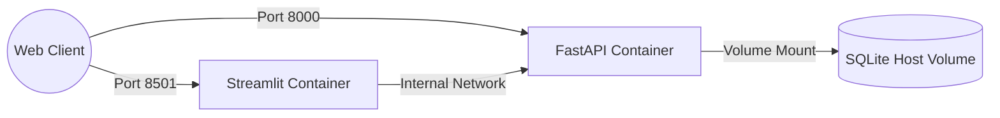

# Production Deployment Guide

This document describes how to deploy the Nifty 100 Financial Intelligence Platform using Docker containerization for local or production hosting.

## 1. Container Architecture

The deployment orchestrates two main services:
- **`backend`**: Runs the FastAPI REST API using `uvicorn` on port `8000`.
- **`frontend`**: Runs the Streamlit dashboard on port `8501`.



---

## 2. Docker Setup

### Prerequisites
- Install **Docker Desktop** (Windows/macOS) or **Docker Engine & Compose** (Linux).
- Ensure ports `8000` and `8501` are not occupied.

### Local Seeding
Ensure you populate the database on the host before running the containers, or let the volume mount persist an existing database.
```bash
# Seed the DB locally
.\run.bat etl
```

### Building and Running Containers
Build and launch the containers in detached (background) mode:
```bash
docker compose up --build -d
```

Verify that the containers are running:
```bash
docker compose ps
```

---

## 3. Access Endpoints

Once the compose configuration starts successfully:
- **FastAPI API Swagger Documentation**: Visit [http://localhost:8000/docs](http://localhost:8000/docs)
- **FastAPI Health Route**: Visit [http://localhost:8000/](http://localhost:8000/)
- **Streamlit Analytics Dashboard**: Visit [http://localhost:8501/](http://localhost:8501/)

---

## 4. Volume Mounts & Data Persistence

The `docker-compose.yml` mounts local folders to maintain persistence:
- `./db:/app/db`: Persists the SQLite database file (`db/nifty100.db`).
- `./output:/app/output`: Keeps all exported Excel screener and peer spreadsheets.
- `./logs:/app/logs`: Aggregates logs written by the services.

To restart containers without rebuilding:
```bash
docker compose stop
docker compose start
```

To stop and remove containers and networks:
```bash
docker compose down
```
*(This will preserve files inside `./db`, `./output`, and `./logs` folders on the host).*
