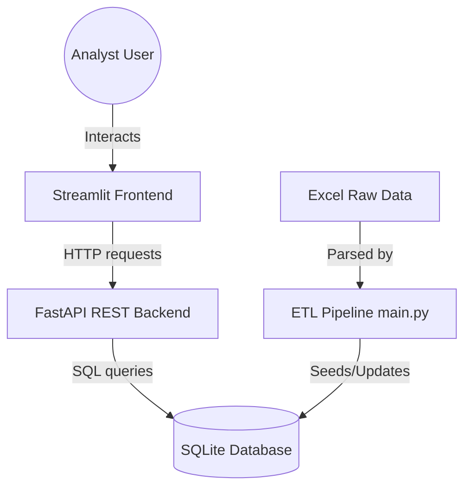
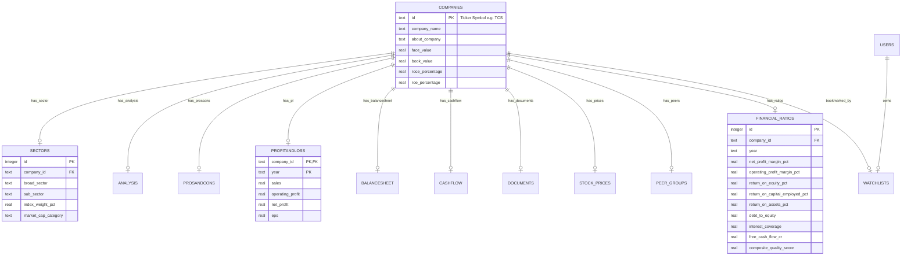
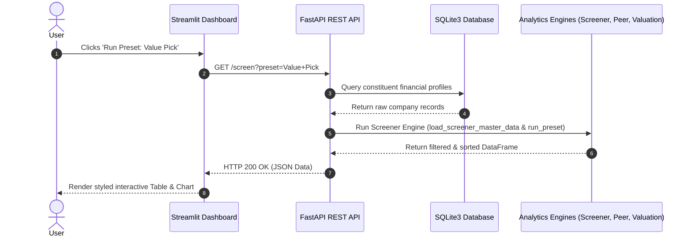
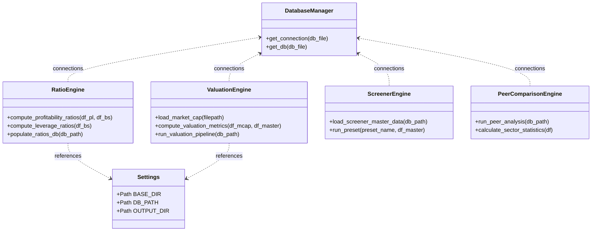

# Nifty 100 Financial Intelligence - System Architecture

This document details the architectural layout, component interactions, database schema, and object relationships for the Nifty 100 Financial Intelligence Platform.

## 1. System Overview

The platform uses a decoupled three-tier architecture:
- **Data Tier**: SQLite3 database (`db/nifty100.db`) storing company metadata, historical financials (P&L, Balance Sheet, Cash Flow), daily stock prices, and pre-calculated analytical ratios.
- **Service Tier (Backend)**: FastAPI REST API exposing standard endpoints for screening, peer group rankings, and dynamic valuation metrics.
- **Presentation Tier (Frontend)**: Modular Streamlit dashboard providing interactive charting, screens, tearsheets, and comparative reports.

---

## 2. Database Schema (ER Diagram)

The database schema is optimized for range queries, sector aggregation, and fast financial ranking joins.

---

## 3. Sequence Diagram (User Request Flow)

This diagram describes the lifecycle of an analytical request (e.g. running the Screener or loading a Company profile):

---

## 4. Class & Component Diagram

The code structure uses independent functional managers that import shared configurations and helper utils:

