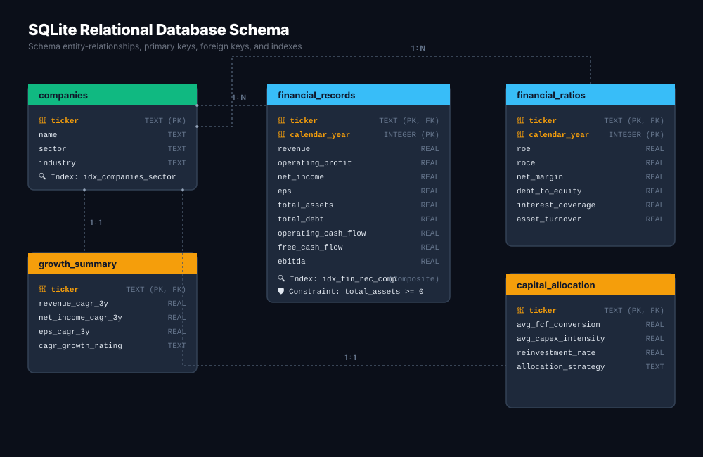

# Database Design & Relational Schema

This document details the relational database design, schema tables, entity relationships, indexing strategies, storage rationale, and data integrity mechanisms for the **Nifty 100 Financial Intelligence Platform**.

---

## 1. Storage Rationale (Why SQLite?)

The database is built on **SQLite3**, a serverless, zero-configuration, file-backed relational database engine.

### Core Reasons:
1.  **Zero Dependency Onboarding**: Allows developers to clone the repository and run the engine immediately without installing local database services (PostgreSQL, MySQL, Oracle) or configuring user passwords.
2.  **ACID Transaction Support**: Guarantees database integrity during pipeline loads. If an error occurs halfway through importing 92 companies, the entire transaction is rolled back, preventing partial data pollution.
3.  **Sub-Millisecond Read Performance**: Since the DB file is read directly from disk into RAM (and cached by the OS), simple queries and joins execute faster than network-based Client-Server databases.
4.  **Write-Ahead Logging (WAL)**: Enabled by default, allowing concurrent readers to access tables without blocking the database writer.

---

## 2. Table Relational Schema

The database consists of 13 tables designed to preserve referential integrity.



### 📐 Entity-Relationship Diagram (Text)
```text
           +-----------------+
           |    COMPANIES    | (Master Table)
           +--------+--------+
                    |
      +-------------+-------------+-------------+-------------+
      | 1:N         | 1:N         | 1:N         | 1:N         | 1:N
      v             v             v             v             v
+-----------+ +-----------+ +-----------+ +-----------+ +-----------+
|  SECTORS  | |  P & L    | | BALANCESHT| | CASHFLOW  | |  RATIOS   |
+-----------+ +-----------+ +-----------+ +-----------+ +-----------+
      |                                                       |
      | 1:N                                                   | 1:N (Mapped via Users)
      v                                                       v
+-----------+                                           +-----------+
|PEER GROUPS|                                           |WATCHLISTS |
+-----------+                                           +-----+-----+
                                                              ^
                                                              | 1:N
                                                        +-----+-----+
                                                        |   USERS   |
                                                        +-----------+
```

---

## 3. Detailed Table Dictionary

### 3.1 `companies` (Master Table)
Contains key metadata for all Nifty 100 constituents:
*   `id` (TEXT, Primary Key): Unique company ticker symbol (e.g. `TCS`, `INFY`).
*   `company_name` (TEXT, Not Null): Full legal name of the entity.
*   `face_value` (REAL) & `book_value` (REAL): Basic share metrics.
*   `roce_percentage` (REAL) & `roe_percentage` (REAL): Reported ratios.

### 3.2 `sectors`
Maps companies to sector classification and indices:
*   `id` (INTEGER, Primary Key Auto-Increment)
*   `company_id` (TEXT, Foreign Key -> `companies(id)` with `ON DELETE CASCADE`)
*   `broad_sector` (TEXT) & `sub_sector` (TEXT): Classification groups.
*   `index_weight_pct` (REAL): Allocation weighting within the Nifty 100 Index.

### 3.3 `profitandloss`
Historical annual Profit & Loss statement records:
*   `company_id` (TEXT, Composite Primary Key, Foreign Key -> `companies(id)` with `ON DELETE CASCADE`)
*   `year` (TEXT, Composite Primary Key): Financial year in `YYYY-MM` format.
*   `sales` (REAL), `operating_profit` (REAL), `net_profit` (REAL), `eps` (REAL), `dividend_payout` (REAL)

### 3.4 `balancesheet`
Historical annual Balance Sheet records:
*   `company_id` (TEXT, Composite Primary Key, Foreign Key -> `companies(id)` with `ON DELETE CASCADE`)
*   `year` (TEXT, Composite Primary Key): Financial year in `YYYY-MM` format.
*   `equity_capital` (REAL), `reserves` (REAL), `borrowings` (REAL), `total_assets` (REAL), `total_liabilities` (REAL)

### 3.5 `cashflow`
Historical annual Cash Flow statement records:
*   `company_id` (TEXT, Composite Primary Key, Foreign Key -> `companies(id)` with `ON DELETE CASCADE`)
*   `year` (TEXT, Composite Primary Key): Financial year in `YYYY-MM` format.
*   `operating_activity` (REAL), `investing_activity` (REAL), `financing_activity` (REAL), `net_cash_flow` (REAL)

### 3.6 `financial_ratios`
Computed KPI metrics populated by the analytical ratio engine:
*   `company_id` (TEXT, Composite Unique, Foreign Key -> `companies(id)` with `ON DELETE CASCADE`)
*   `year` (TEXT, Composite Unique)
*   `net_profit_margin_pct` (REAL), `operating_profit_margin_pct` (REAL), `return_on_equity_pct` (REAL), `return_on_capital_employed_pct` (REAL), `debt_to_equity` (REAL), `interest_coverage` (REAL), `free_cash_flow_cr` (REAL), `composite_quality_score` (REAL)

### 3.7 `users` & `watchlists`
Authentications and watchlist persistence:
*   `users`: Stores `username` (UNIQUE), `password_hash` (SHA-256), and authorization `role`.
*   `watchlists`: Maps `user_id` to `company_id` (Unique composite key, cascade deletes).

---

## 4. Indexing & Optimization Strategy

To support high-performance analytical queries and dashboard loads, indexes are built over critical query lookup paths:

| Index Name | Target Table | Columns Indexed | Query Target |
| :--- | :--- | :--- | :--- |
| `idx_sectors_company_id` | `sectors` | `company_id` | Speeds up sector joins in multi-company tables. |
| `idx_sectors_broad_sector`| `sectors` | `broad_sector` | Optimizes dashboard filtering by broad sectors. |
| `idx_pl_company_year` | `profitandloss` | `company_id, year` | Speeds up multi-year P&L trends calculations. |
| `idx_bs_company_year` | `balancesheet` | `company_id, year` | Speeds up Balance Sheet ratios and leverage audits. |
| `idx_cf_company_year` | `cashflow` | `company_id, year` | Accelerates Free Cash Flow calculations. |
| `idx_stock_prices_company_date`| `stock_prices` | `company_id, date` | Accelerates daily pricing loads. |
| `idx_watchlists_user_id` | `watchlists` | `user_id` | Speeds up loading custom watchlists upon user log-in. |

---

## 5. Data Integrity Framework

1.  **Foreign Key Constraints**: SQLite connections explicitly execute `PRAGMA foreign_keys = ON;` upon initialization. This prevents inserting orphan records with missing company codes, and cascades deletes when a company master record is deleted.
2.  **Composite Primary Keys**: Financial statement tables enforce `PRIMARY KEY (company_id, year)`. This prevents duplicate filings for the same period.
3.  **Automatic DB Backups**: Prior to executing the ETL load process, the loader copies the existing `db/nifty100.db` to `db/backups/nifty100_backup_YYYYMMDD_HHMMSS.db`. It retains the latest 5 backups automatically, facilitating easy rollback.
