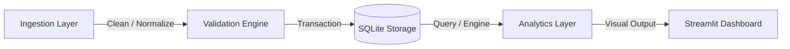
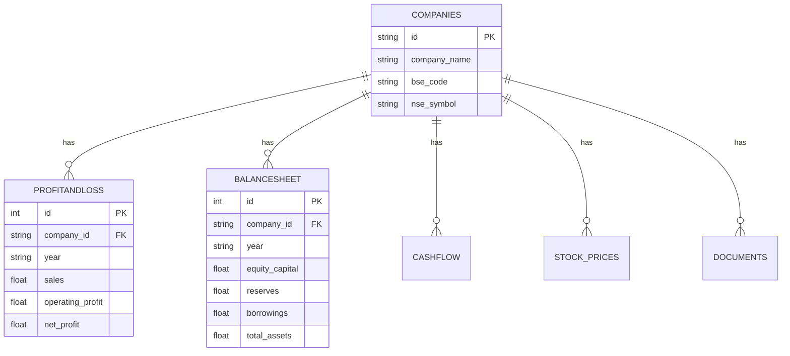

# System Design Specification

This document details the architectural design, data lifecycle, validation logic, and analytics calculation methodology for the **Nifty 100 Financial Intelligence Platform**.

---

## 1. System Overview

The platform is designed to automate the ingestion, validation, and analytics of corporate financial filings (P&L, Balance Sheet, Cash Flow, and Stock Valuation) for Nifty 100 constituents. It is implemented in Python, utilizing SQLite as a relational storage backend and Streamlit for interactive visuals.

---

## 2. Ingestion & ETL Layer

### 2.1 Multi-File Excel Loader
- **`src/etl/loader.py`**: Reads raw worksheets. Auto-detects table offsets and handles varied sheet architectures.
- **Normalization**:
  - Tickers standardizer (`normalize_ticker`): Cleans and enforces uppercase alphanumeric codes.
  - Date standardizer (`normalize_year`): Conforms diverse text dates to calendar month format (`YYYY-MM`).

---

## 3. Data Quality (DQ) Validation Framework

Before data is written to the SQLite database, it is passed through the `DataValidator` engine. The platform runs 16 distinct DQ checks:

1.  **Blocker Rules (5 Checks)**: Integrity violations that halt database loading to prevent corruption:
    -   `DQ-01`: Primary key uniqueness in companies master.
    -   `DQ-02`: Composite primary key `(company_id, year)` uniqueness.
    -   `DQ-03`: Foreign Key validation.
    -   `DQ-07`: Date formatting.
    -   `DQ-08`: Ticker syntax constraints.
2.  **Warning Rules (11 Checks)**: Non-blocker checks that raise warnings and write logs but permit ingestion:
    -   `DQ-04`: Balance Sheet equilibrium (`Assets == Liabilities`).
    -   `DQ-05`: OPM cross-check margin audit.
    -   `DQ-06`: Negative revenue check.
    -   `DQ-09`: Net cash flow summation check.
    -   `DQ-10` to `DQ-16`: Advanced checks (Tax rate ranges, payout bounds, URL integrity, historical length, etc.).

---

## 4. Relational Database Design

The relational database (`db/nifty100.db`) is structured to preserve referential integrity:

- **Safety & Performance**:
  - Enforces `PRAGMA foreign_keys = ON;` on all database connections.
  - Enforces Write-Ahead Logging (WAL) mode for multi-threaded readability.
  - Implements an auto-backup rotation system storing database snapshots under `db/backups/`.

---

## 5. Analytics & KPI Calculation Engine

The calculations are divided into modular analytics engines:

### 5.1 Profitability & Solvency Ratios
- **ROE & ROCE**: Evaluates operational returns. Distinguishes financial vs non-financial sector leverage structures.
- **Interest Coverage (ICR)**: Captures debt serviceability limits. Asserts warnings for values below 1.5.

### 5.2 Compound Annual Growth Rate (CAGR) Engine
- Computes 3Y, 5Y, and 10Y rolling growth rates.
- Handles 6 distinct mathematical edge cases:
  - `VALID`
  - `DECLINE_TO_LOSS`
  - `TURNAROUND`
  - `BOTH_NEGATIVE`
  - `ZERO_BASE`
  - `INSUFFICIENT_DATA`

### 5.3 Cash Flow & Capital Allocation Engine
- Computes **Free Cash Flow (FCF)** as `CFO + CFI`.
- Classifies company allocation patterns using an 8-rule sign matrix (`CFO`, `CFI`, `CFF`) into:
  - **Reinvestor** (`+ CFO`, `- CFI`, `- CFF`)
  - **Distress Signal** (`- CFO`, `- CFI`, `+ CFF`)
  - **Shareholder Returns** (`+ CFO`, `+ CFI`, `- CFF`), etc.

---

## 6. Dashboard Interface

Exposes calculations through 8 Streamlit screens:
- **`01_home.py`**: Market overview & key metrics.
- **`02_profile.py`**: Detailed financial health cards.
- **`03_screener.py`**: Inbound filters & sliders.
- **`04_peers.py`**: Radar peer comparisons.
- **`05_trends.py`**: YoY metrics line plots.
- **`06_sectors.py`**: Sector revenue/ROE scatter bubbles.
- **`07_capital.py`**: Reinvestment strategy treemap.
- **`08_reports.py`**: Filing document viewer.
